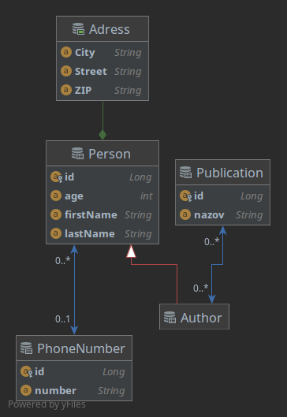
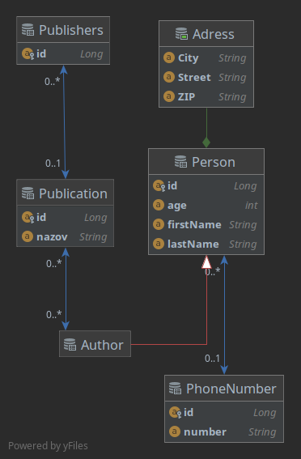

# Hibernate demo

Ukážkový príklad ako použiť Hibernate ORM na prácu s databázou.

## Požiadavky na spojenie s DB
-  URL: `localhost:3306`
- Typ databázy: `MariaDB`
-  Názov vyvorenej databázy: `hibernate`
-  Užívatel: `userDemo`
-  Heslo: `userDemo`

Štandardné nastavenie môžete zmeniť v súbore: `hibernate.cfg.xml`

## Popis:

Aplikácia demoštruje základné možnosti použitia Hibernate frameworku na vytvorenie dátového modelu ako napr. použitie `@ManyToMany, @OneToMany, @Embeddable, @Inheritance,@Entity`. Ďalej ilustuje základné možnosti použitia *HQL* jazyka a api *CriteriaQuery*.

### ER model (entitne vzťahový model) 

### Úloha 

Doplnte nový vzťah One-to-Many medzi publikáciou a vydavateľstvom(Publishers). 

### Odkazy
- [Hibernate Docs](http://docs.jboss.org/hibernate/orm/current/userguide/html_single/Hibernate_User_Guide.html#domain-model)
- [jpql tutorial](https://thoughts-on-java.org/jpql/)
- [jpa cheatsheet](https://gist.github.com/jahe/18a4efe614fc73cf184d8ceef8cdc996)
- [Dedičnosť](https://www.baeldung.com/hibernate-inheritance)
- [Agregačné funkcie](https://www.baeldung.com/hibernate-aggregate-functions)
- [Criteria Query](https://www.baeldung.com/hibernate-criteria-queries)
- [Generátor metadát](https://docs.jboss.org/hibernate/orm/5.3/topical/html_single/metamodelgen/MetamodelGenerator.html)

 

